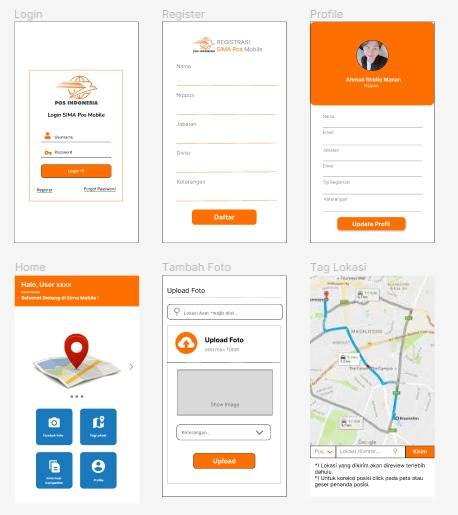

# Judul Aplikasi
Aplikasi Pencarian Pesaing Ekspedisi untuk PT. Pos Indonesia 

## Deskripsi Masalah
Karena banyaknya pesaing pengiriman ekspedisi saat ini, maka PT. Pos Indonesia perlu menandai titik lokasi pesaing sebagai media pembantu keputusan pembuatan outlet baru.

## Deskripsi Solusi
- Dibuatnya aplikasi untuk penanda titik lokasi pesaing serta memunculkan informasi ada berapa pesaing ekspedisi di lokasi tertentu.

## Use Case
- User admin lapangan mampu menginput titik lokasi outlet pesaing dan memunculkan informasi outlet yang sudah di input.
- User manager dapat melihat informasi titik koordinat, gambar, dan jumlah pesaing di setiap lokasi.

## Struktur Data

### Tempat
Nama Atribut | Tipe Data | Contoh
---|---|---
UUID | string | ooj73849r734mf34r3
Ourlet | string | JNE
Lokasi | string | JNE Pasar Baru
Kabupaten/Kota | string | Kota Bandung
Provinsi | string | Jawa Barat
Foto | string | img123.jpg
🌏 Koordinat | poin | [-6.909221321729901, 107.6184440879297]
🌏 Area | polygon | [[106.03794 -6.39284693], [106.03794 -6.39284693], [106.03794 -6.39284693]]

### User
Nama Atribut | Tipe Data | Contoh
---|---|---
UUID | string | ooj73849r734mf34r3
Nama user | string | Asep
level user | string | Manager

## Mockup UX

